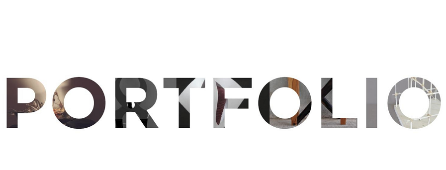
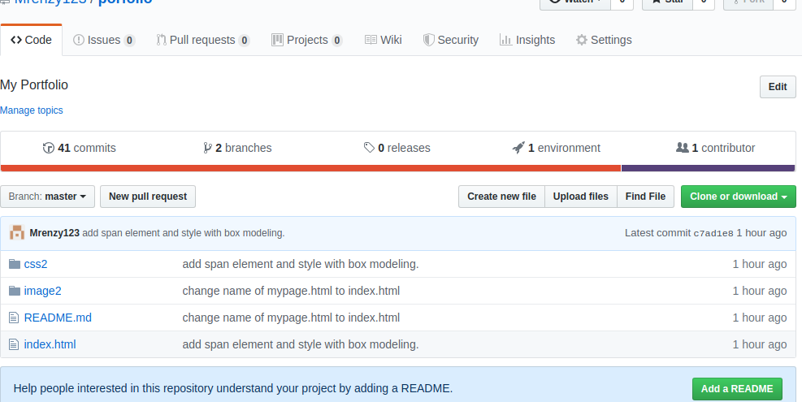
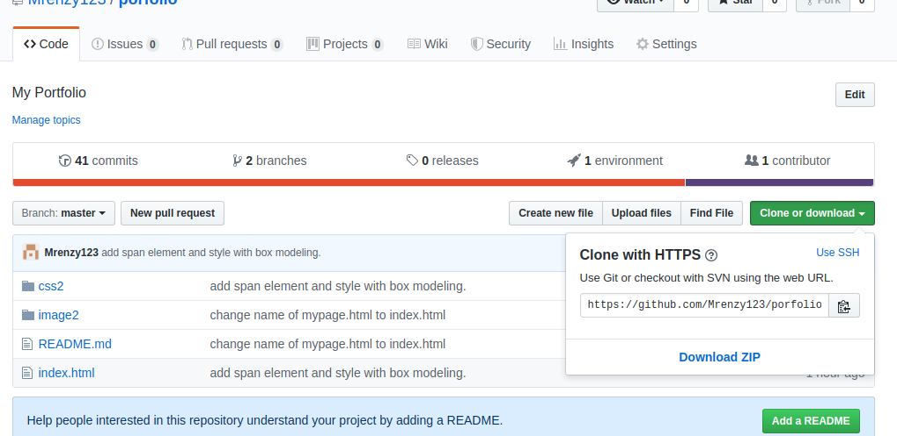

# PERSONAL PORTFOLIO
#### By Deborah MWANGANJYE
## Project Description
A personal portfolio using HTML and CSS to present some things about me , like my educational background, passion for coding ,my skills, personal interests and hobbies. A good way to help viewers easily get a glimpse of who i am .A start for building connections due to my interests and skills . Please feel free to view my page.
## Project Cloning Instructions

* In order to clone my work, check the green button on your right and click on it.
* 
* After clicking on green button ,there is a drop down which shows a web url.
* Now copy the link by selecting and right-clicking or just click on the icon besides the link.
* Now you can go to your terminal and copy the link in a non-git initialised folder.
* Tah dah!! You are done with cloning my page to your computer.
## Live site Link :
 [Porfolio link for Deborah](https://mrenzy123.github.io/porfolio/)
### License
Copyright (c) 2019  Deborah Mwanganjye